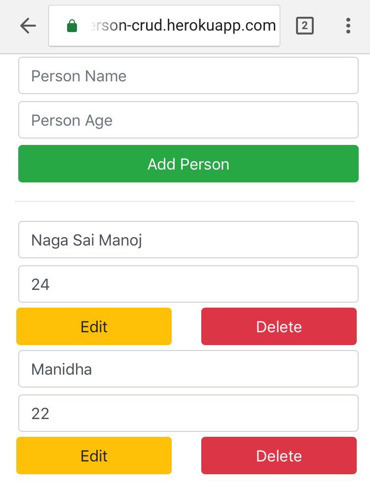

# Person-CRUD
This code for a sample [CRUD](https://en.wikipedia.org/wiki/Create,_read,_update_and_delete) application using Spring-Boot, JSP & AngularJS

This project is hosted on heroku. Link [here](http://person-crud.herokuapp.com/)

### Dependencies
* [Spring-Boot](https://projects.spring.io/spring-boot/)
* [JSP](http://www.oracle.com/technetwork/java/javaee/jsp/index.html)
* [AngularJS](https://angularjs.org/)
* [Maven](https://maven.apache.org/)
* [Tomcat Server](http://tomcat.apache.org/)
* [postgre db](https://www.postgresql.org/)
* [h2 in-memory db](http://www.h2database.com/)

### Usage
This site's Front end has both JSP & AngularJS variations

[AngularJS based site](http://person-crud.herokuapp.com/r)

[JSP based site](http://person-crud.herokuapp.com/)

### Screenshot

- - - -
mail me @ nagasai.g9@gmail.com
